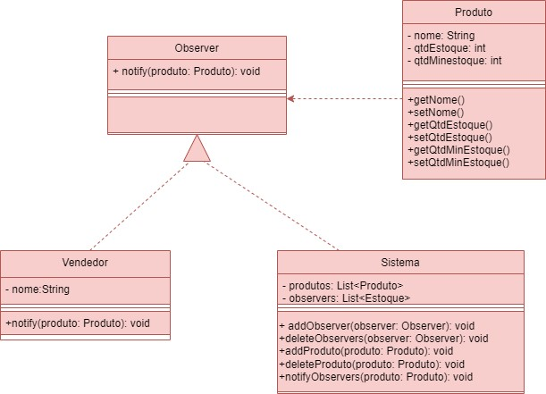

<h1> COMPOSITE </h1>

 o padrão Composite ele pode ser considerado com o conceito de árvore, pois nele há os componentes.

 

__Site para usar o Composite:__ https://refactoring.guru/design-patterns/observer

<h2>Diagrama UML</h2>

