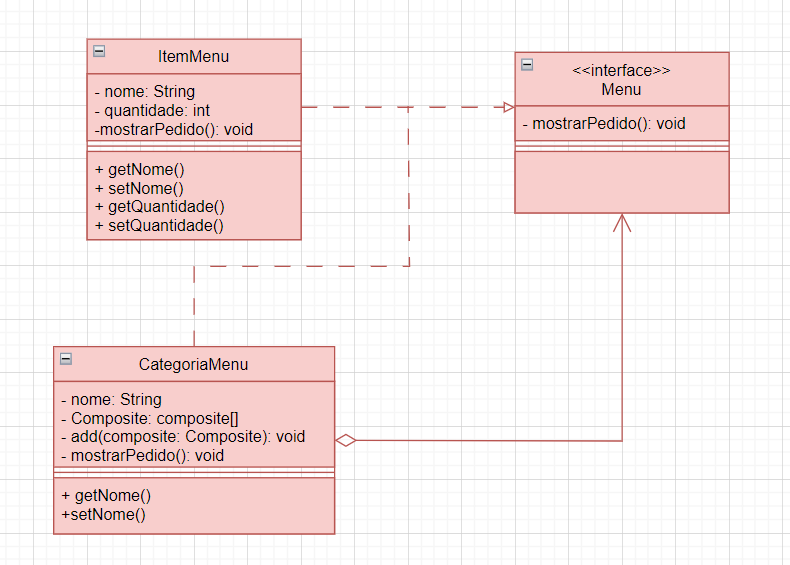

<h1> COMPOSITE </h1>

 O Composite é um padrão de design que permite organizar objetos em uma estrutura de árvore. Ele simplifica o tratamento de objetos individuais e grupos de objetos, possibilitando que sejam tratados de maneira uniforme. Isso é útil em cenários onde você precisa lidar com hierarquias de objetos, como árvores de elementos gráficos ou estruturas de menu. O padrão Composite promove a reutilização e flexibilidade do código, permitindo que você construa composições complexas de objetos de forma simples e coesa. É uma abordagem eficaz para criar sistemas que lidam com objetos aninhados..

 

__Site para usar o Composite:__ https://refactoring.guru/design-patterns/observer

<h2>Diagrama UML</h2>

