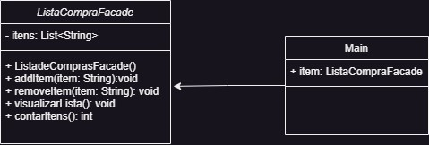

<h1> FACADE </h1>

 O facade nos podemos utilizar basicamente um codigo que ira facilitar na complexidade do codigo.
 

__Site para usar o Facade:__ https://refactoring.guru/design-patterns/facade

