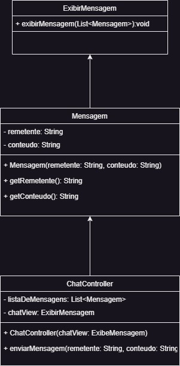

<h1> MVC </h1>

 MVC , um projeto onde juntamos os 3 padrões de projeto:
 strategy
- observer
- composite

O nome MVC, vem das iniciais de Model, Controller e View. Assim podemos juntar estes padrões.
 
 

<h3>Strategy:</h3>

<h4>Onde está sendo usado:</h4>
Em como mostramos as mensagens no chat.
<h4>Como está sendo usado:</h4> Temos diferentes jeitos de exibir as mensagens. Por exemplo, uma pode mostrar as mensagens em negrito, outra em itálico. A classe ChatView define essas formas diferentes de mostrar as mensagens.

<h3>Composite:</h3>

<h4>Onde está sendo usado:</h4>
Para organizar as mensagens.
<h4>Como está sendo usado:</h4>
Podemos ter uma única mensagem ou um monte delas agrupadas. A classe ChatController permite lidar tanto com mensagens individuais quanto com grupos delas, criando uma espécie de árvore de mensagens.

<h3>Observer:</h3>

<h4>Onde está sendo usado:</h4>
 Para saber quando chega uma nova mensagem e mostrar para quem está vendo o chat.
<h4>Como está sendo usado:</h4>
 Quando alguém envia uma mensagem, a classe ChatController avisa a ChatView para atualizar a tela e mostrar a mensagem nova. A ChatView fica observando por essas mudanças e age quando algo acontece.

 

 
