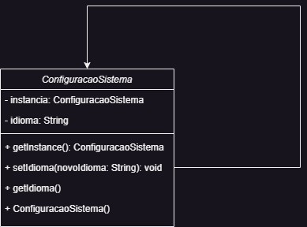

<h1> SINGLETON </h1>

 O Singleton garante que uma classe tenha apenas uma instância e fornece um ponto global de acesso a essa instância. Em outras palavras, o Singleton garante que uma classe tenha apenas um objeto único (instância) e fornece um meio para acessar essa instância a partir de qualquer ponto do programa..
 

__Site para usar o Facade:__ https://refactoring.guru/design-patterns/singleton

