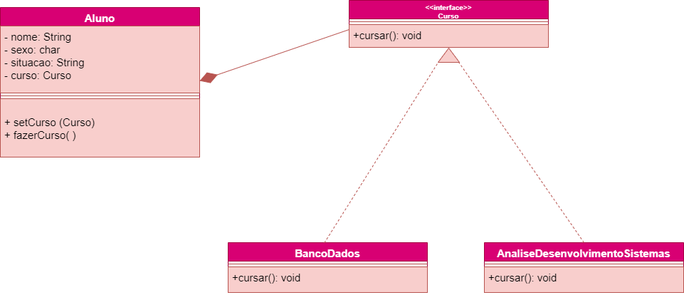

<h1> STRATEGY </h1>

 O strategy é um comportamento onde usamos a Interface para podemos evitar de usar o polimorfismo,
onde poderia gerar um duplicação de código.

//O Strategy encapsula uma familia de algoritmos (Locomocao)
// e os torna intercambiaveis por polimorfismo

__Site para usar o Strategy:__ https://refactoring.guru/design-patterns/strategy

